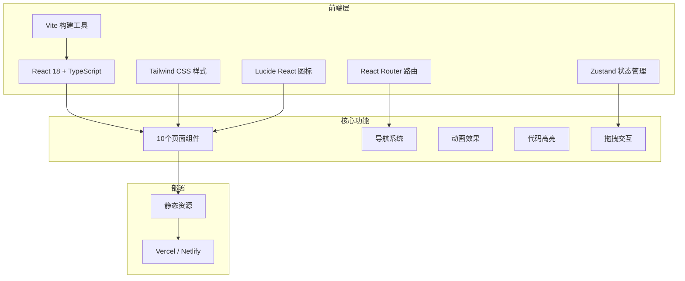

# AI Drama OS 技术架构文档

## 1. Architecture Design



## 2. Technology Description
- 前端：React@18 + TypeScript@5 + tailwindcss@3
- 构建工具：Vite@5
- 路由：react-router-dom@6
- 状态管理：zustand@4
- 图标：lucide-react@0.3
- 代码高亮：prismjs
- 动画：CSS Transition + Framer Motion
- 后端：无（纯前端展示）
- 数据库：无

## 3. Route Definitions
| Route | Purpose |
|-------|---------|
| / | 封面页 - 项目展示入口 |
| /overview | 项目总览 - 愿景与路线图总览 |
| /roadmap | 产品路线图 - 9阶段详细拆解 |
| /protocol | 核心数据协议 - 数据与Prompt规范 |
| /architecture | 系统模块架构 - 7大系统模块 |
| /workflow | 工作流引擎 - 全链路生产流程 |
| /agents | 多Agent团队 - 角色与协作 |
| /canvas | 无限画布 - 可视化工作流原型 |
| /commercial | 商业化模块 - 定价与商业模式 |
| /devplan | 技术开发计划 - 任务与里程碑 |

## 4. Component Structure
```
src/
├── components/
│   ├── layout/
│   │   ├── Navbar.tsx          # 顶部导航
│   │   └── Sidebar.tsx         # 侧边栏导航
│   ├── common/
│   │   ├── Card.tsx            # 通用卡片
│   │   ├── CodeBlock.tsx       # 代码块
│   │   ├── Timeline.tsx        # 时间轴
│   │   └── FlowNode.tsx        # 流程节点
│   └── pages/
│       ├── Cover.tsx           # 封面页
│       ├── Overview.tsx        # 项目总览
│       ├── Roadmap.tsx         # 产品路线图
│       ├── Protocol.tsx        # 核心数据协议
│       ├── Architecture.tsx    # 系统模块架构
│       ├── Workflow.tsx        # 工作流引擎
│       ├── Agents.tsx          # 多Agent团队
│       ├── Canvas.tsx          # 无限画布
│       ├── Commercial.tsx      # 商业化模块
│       └── DevPlan.tsx         # 技术开发计划
├── hooks/
│   └── useScrollAnimation.ts   # 滚动动画
├── utils/
│   └── colors.ts               # 颜色配置
├── App.tsx                     # 主应用
├── main.tsx                    # 入口文件
└── index.css                   # 全局样式
```

## 5. Color System
```typescript
// 主色
const primary = {
  50: '#E8F3FF',
  100: '#B9D8FF',
  200: '#8ABFFF',
  300: '#5BA6FF',
  400: '#2D8CFF',
  500: '#165DFF',
  600: '#0E42D2',
  700: '#0A2BA6',
  800: '#061A79',
  900: '#030D4C',
};

// 辅助色
const colors = {
  purple: '#722ED1',
  orange: '#FF7D00',
  green: '#00B42A',
  red: '#F53F3F',
  yellow: '#FFAA00',
  cyan: '#0FC6C2',
};

// 中性色
const neutral = {
  100: '#F2F3F5',
  200: '#E5E6EB',
  300: '#C9CDD4',
  400: '#86909C',
  500: '#4E5969',
  600: '#272E3B',
  700: '#1D2129',
  800: '#000000',
};
```

## 6. Key Technical Points
### 6.1 页面切换动画
- 使用 Framer Motion 实现页面切换过渡
- 入场动画：从下往上渐入
- 退场动画：透明度渐变
- 导航高亮状态同步

### 6.2 无限画布交互
- 使用原生 HTML5 Drag & Drop API
- 节点拖拽位置计算
- 连线 SVG 绘制
- 缩放与平移控制

### 6.3 响应式布局
- Tailwind CSS 断点系统
- sm: 640px, md: 768px, lg: 1024px, xl: 1280px
- 移动端导航抽屉
- 卡片网格自适应

### 6.4 性能优化
- 代码分割：React.lazy + Suspense
- 图片懒加载
- 动画使用 transform + opacity
- 避免不必要的重渲染
